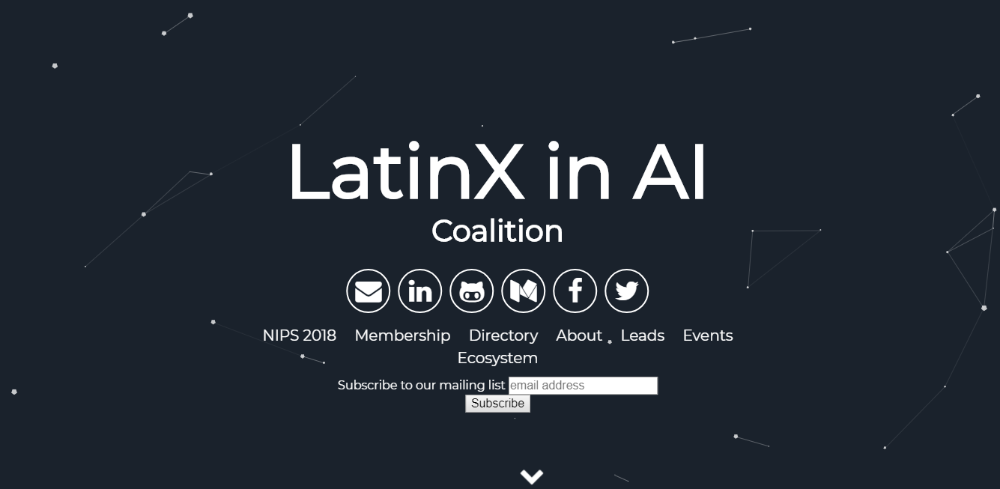

# LatinX in AI Coalition

This is an opensource website for the LatinX in AI Coalition. Our organization is volunteer run, so we welcome and encourage contributions from our community and allies! 

Familiarize yourself with the following documentation before getting started.

## The Docs:

- [Github Pages Hosting](https://pages.github.com/)
- [Jekyll Site Generator](https://jekyllrb.com/)
- [Particle Jekyll Theme](https://jekyll-themes.com/particle/)
- [NodeJS](https://nodejs.org/)
- [NPM](https://www.npmjs.com/get-npm)
- [Yarn](https://yarnpkg.com/en/)
- [Particle.js](https://github.com/VincentGarreau/particles.js/)
- [Google Analytics](https://analytics.google.com/analytics/web/provision/?authuser=0#/provision)
- [Open-Source Style Guides](http://google.github.io/styleguide/)

## Basic Setup

To contribute to this opensource website, complete the following steps:

1. Clone this repository.
    `git clone https://github.com/latinxinai/latinxinai.github.io.git`
2. Change directories into cloned repository.
    `cd latinxinai.github.io`
2. Create your own branch.
    `git checkout -b 'your-branch-name'`
3. Install [Ruby](https://www.ruby-lang.org/en/downloads/) and [Jekyll](https://jekyllrb.com/docs/installation/) if you haven't already.
4. Install [Node.js](https://nodejs.org/) and NPM is you haven't already.
3. Install node packages 
    `npm install`

## Running Locally

In order to compile the assets and run the latest version of the site locally complete the following:

- Pull latest version
    `git pull origin master`
- Run Jekyll Server
    `jekyll serve`
- Now browse to http://localhost:4000

## Pushing Changes

Follow these **guidelines** when contributing to this site:

- Always work off your own branch!
- Never push to the master branch!!
- Push to your branch and then [create a pull request](https://help.github.com/articles/creating-a-pull-request/).
- Follow standard [open-source style guides](http://google.github.io/styleguide/).
- Correct any suggested edits from LXAI and resubmit your pull request for additional review.
- Once your changes have been accepted and merged to master by a representative of the LatinX in AI Coalition, your name may be added to the credits below. 

## Questions

Having any issues with the site? See something that can be improved? 

File a [GitHub Issue](https://github.com/latinxinai/latinxinai.github.io/issues).										

## License

GNU General Public License v3.0

## Credits

This theme was partially designed with the inspiration from these fine folks
- [Willian Justen](https://github.com/willianjusten/will-jekyll-template)
- [Vincent Garreau](https://github.com/VincentGarreau/particles.js/)
- [Nathan Randecker](https://github.com/nrandecker/)

This site has been modified by and built upon by the these folks
- [Laura Montoya](https://github.com/quickresolve)
- [Pablo Samuel Castro]()
- [Yannet Interian]()
- [Sebastian Anaya]()
- [Victor Ramirez]()
- 
